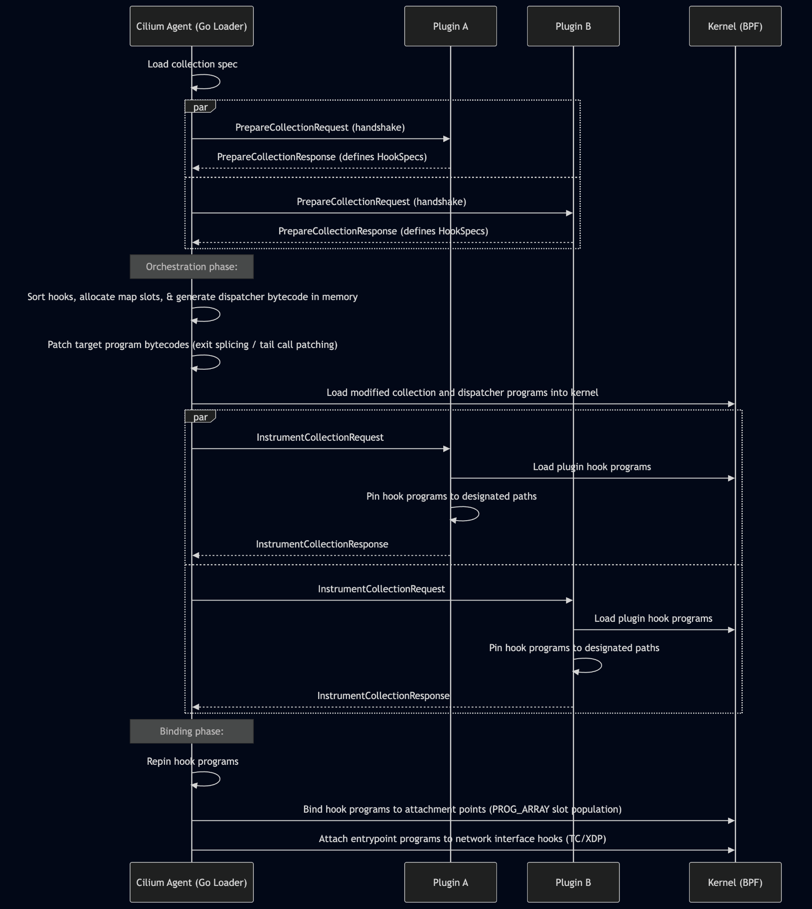
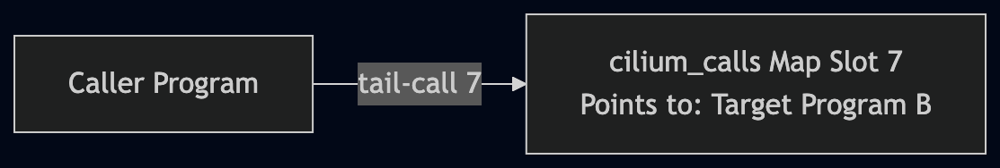
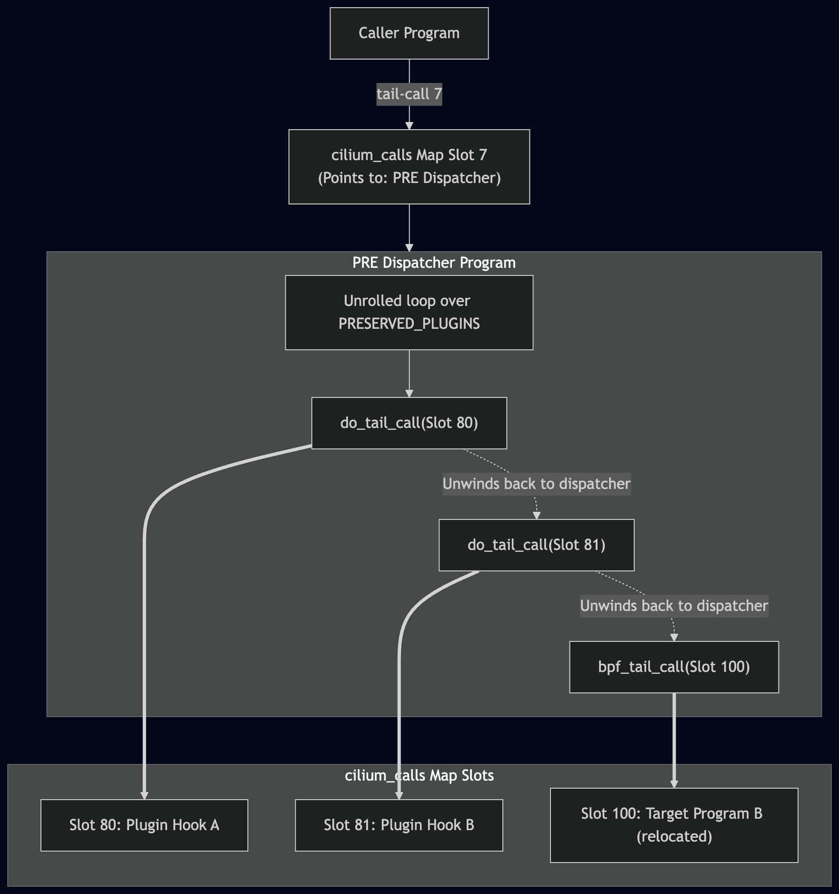
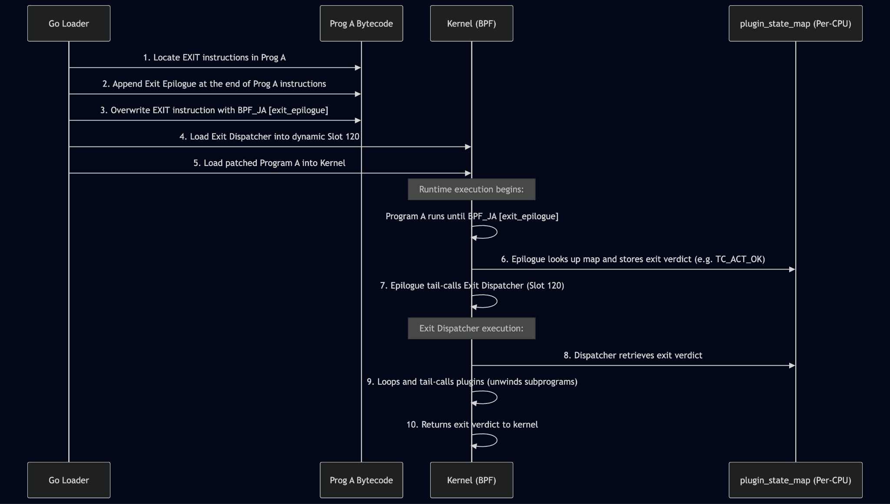
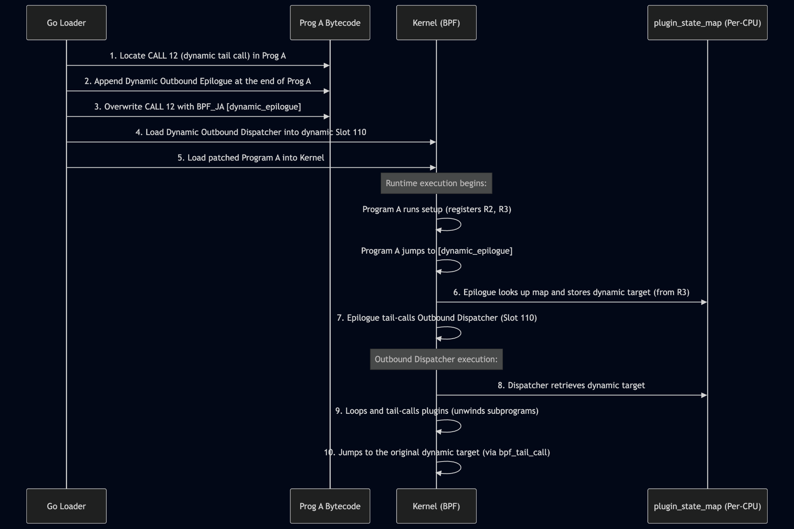
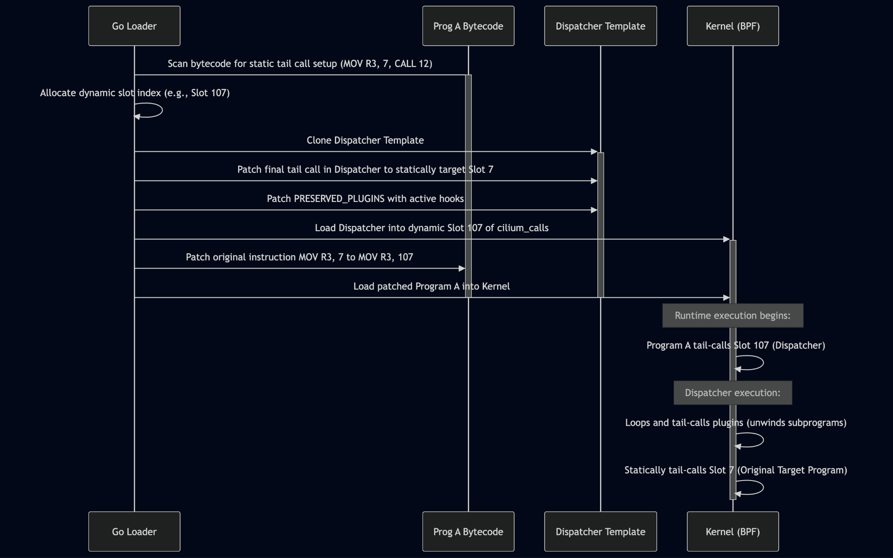

# **Datapath Plugins: Fine-Grained Instrumentation**

## Intercepting Local Exits And Tail Calls

# Summary

Cilium's Datapath Plugins framework ([CFP-41634](https://github.com/cilium/design-cfps/blob/main/cilium/CFP-41634-datapath-plugins.md)) allows operators to inject custom BPF programs into the datapath without modifying Cilium's core C source. Currently, the framework only allows developers to inject custom hooks before or after entry point programs such as `cil_from_container` or `cil_from_netdev`.

However, this is insufficient for features that must inject logic or modify Cilium control flow in the middle of a program’s execution path.

To support fine-grained instrumentation, we extend the datapath plugins framework to enable entry and exit instrumentation of individual tail call programs . This design outlines changes to the plugin gRPC interface and eBPF collection instrumentation engine that enable fine-grained hook points throughout the datapath.

# Design

## Overview

Previously, datapath plugins were limited to executing before or after entrypoint programs. Tail-call instrumentation allows plugins to request to be attached at more granular boundaries (PRE-hooks of tail-called programs, jumps from tail-called program, and exits from tail-called programs). This orchestration operates across three main phases:

* Handshake and Hook Definition: the Cilium Agent initiates a PrepareCollectionRequest with the registered plugins; plugins respond with a PrepareCollectionResponse that defines their requested HookSpecs (i.e. which precise locations they want to run)  
* Orchestration: the Go loader groups and sorts these hooks, allocates the necessary state map slots, and dynamically generates dispatcher bytecode which controls execution of the plugins.  
  * Instrumentation: The Go loader issues an InstrumentCollectionRequest to the registered plugins; the plugins then load their hook programs, pin them to their paths, and ack completion to the loader.  
* Binding: the Go loader handles any necessary program repinning and binds the programs to their attachment points.



## Goals

* Expand PRE hooks support to tail call programs, those residing in PROG\_ARRAY maps.  
* Introduce new hook types that enable interception of local program exits and tail calls.

## Non-Goals

* POST hook support for tail call programs.

## Extending the Cilium Datapath Plugin Interface

To support fine-grained instrumentation, we introduce two new types of hooks to the datapath plugins framework:

* **TAIL\_CALL (tail call hooks):** Intercepts the packet right as it leaves a target program via a tail-call, before entering the next downstream program (excluding terminal kernel exits).  
  * Filtering (optional): Additionally provide optional tail\_call\_map and tail\_call\_target fields that extend TAIL\_CALLs to intercept specific jumps to a target program.  
* **EXIT (local exit hooks):** Intercepts a target program right as it completes its datapath execution and prepares to execute its BPF EXIT instruction to return control back to the kernel.

In contrast to PRE hooks, which share the same execution semantics for entrypoint or tail-called programs, POST hooks cannot be logically applied to tail-called execution. To bridge this gap, we introduce these TAIL\_CALL and EXIT hooks to instrument outbound transitions and local program completions within the tail-call chain.

### PrepareCollectionResponse.HookSpec

```proto
enum HookType {
    UNKNOWN = 0;
    // pre hooks run before a program
    PRE = 1;
    // post hooks run after the main Cilium program
    POST = 2;
    // NEW: terminal transition after target program exits to the kernel
    EXIT = 3;
    // NEW: post transition after target program tail calls another program  
    TAIL_CALL = 4;
}

message PrepareCollectionResponse {
    message HookSpec {
        // An OrderingConstraint is a constraint about where this hook should
        // go at this hook point relative to other plugins' hooks.
        message OrderingConstraint {
            enum Order {
                UNKNOWN = 0;
                BEFORE = 1;
                AFTER = 2;
            }
            Order order = 1;
            string plugin = 2;
        }
        // position of the hook relative to the target program.
        HookType type = 1;
        // name of the program that should be instrumented.
        string target = 2;
        // constraints is a list of ordering constraints for this hook. If other
        // plugins want to place a hook at this same hook point, hooks from
        // various plugins will be arranged in an order that respects all
        // ordering constraints.
        repeated OrderingConstraint constraints = 3;

        // Optional filters for TAIL_CALL hook types to target a specific static tail-call 
        // The name of the target BPF program (e.g. "tail_ipv4_to_endpoint").
        string tail_call_target = 5;

    }
}
```

### HookSpec Example

#### Step 1: PrepareCollection

First, the Cilium agent notifies the plugin of the loaded collection details via a PrepareCollectionRequest:

```json
{
  "collection": {
    "programs": {
      "tail_ipv4_ct_ingress": {
        "type": 3,
        "attach_type": 0,
        "section_name": "classifier/tail_ipv4_ct_ingress",
        "license": "GPL"
      },
      "tail_ipv4_policy": {
        "type": 3,
        "attach_type": 0,
        "section_name": "classifier/tail_ipv4_policy",
        "license": "GPL"
      }
    },
    "maps": {
      "cilium_calls": {
        "type": 2,
        "key_size": 4,
        "value_size": 4,
        "max_entries": 100,
        "flags": 0,
        "pin_type": 0
      }
    }
  }
}
```

Then, the plugin responds with its hook placements:

```json
{
  "hooks": [
    {
      "target": "tail_ipv4_ct_ingress",
      "type": "PRE",
      "constraints": []
    },
   {
      "target": "tail_ipv4_policy",
      "type": "TAIL_CALL",
      "tail_call_map": "cilium_calls",
      "tail_call_target": "tail_ipv4_to_endpoint",
      "constraints": []
    },
    {
      "target": "tail_ipv4_policy",
      "type": "EXIT",
      "constraints": []
    }
  ]
}
```

## Dispatchers

Once we intercept tail-call sites, we must execute our custom plugin hooks sequentially. To do so, we introduce a dynamically generated Dispatcher program to orchestrate user plugins sequentially:

* The Go agent topologically sorts the active plugins and writes their slot indices into an array.  
* In standard BPF, a bpf\_tail\_call unwinds the current stack frame. By wrapping the bpf\_tail\_call helper inside a BPF subprogram, the runtime only unwinds the subprogram’s stack frame upon execution. The original caller program’s frame (the Dispatcher frame) is preserved.  
* The dispatcher loops through the active plugins, calls the subprogram which tail calls the plugin, and control returns back to the dispatcher loop.  
* Gateway Handoff: because the dispatcher remains in control, it reads the original target from the state map and executes a final tail-call to the target program once the loop finishes.  
  * Static tail-calls: we directly emit a bpf\_tail\_call(ctx, map, CONSTANT\_SLOT) at the end of the generated Dispatcher. This allows the compiler to optimize the handoff into a direct jump.  
  * Dynamic tail-calls: If the original target was calculated dynamically at runtime, the generated Dispatcher uses a map lookup. It reads the dynamically stashed target from the plugin\_state\_map and executes a variable tail call.

#### Platform Code: Subprogram Unwinder

```c
/* The Subprogram Helper (Forces JIT stack unwind) */
static __noinline int do_tail_call(struct __sk_buff *ctx, uint32_t slot) {
    // 1. Execute the tail call
    bpf_tail_call(ctx, &cilium_calls, slot);
    // 2. Default fallback if the tail call fails (e.g., empty slot)
    int ret = TC_ACT_UNSPEC;
    
    // From testing:
    // Forces LLVM to treat 'ret' as unknown, so the dispatcher reads the
    // R0 register when plugin returns
    asm volatile("" : "+r"(ret));
    
    return ret;
}
```

## Interception

### PRE Hooks For Tail Call Programs

We cannot implement PRE hooks for tail-called programs using the standard datapath plugin attachment mechanism via freplace because `freplace` [cannot be used](https://lore.kernel.org/all/20241015150207.70264-2-leon.hwang@linux.dev/) with programs placed inside a PROG\_ARRAY map. However, we can intercept tail calls to such programs by replacing their slot in the map with a dispatcher. We rely on expanding the standard cilium\_calls map at load-time. Following the PrepareCollection phase, the Go loader calculates the number of target program hooks required and dynamically increases the map size in the PROG\_ARRAY map. The Go agent reserves these slots and passes them back to the plugin daemon to use for our custom plugins and dispatchers:

* We move the original target program to a dynamically allocated slot index (e.g., Slot 100).  
* We place our dispatcher program at the original static slot (e.g., Slot 7).  
* The dispatcher sequentially tail-calls the hook programs orchestrated on that program.  
* We patch the dispatcher program's placeholder tail-call target to point to the new slot (Slot 100).

Because all inbound paths to target B look up Slot 7, rewriting this single slot routes all traffic through the dispatcher first.

#### Example

Before orchestration, the unmodified datapath flow from a caller program to a target program  looks like



After we use the above mechanism, this looks like:



Any call to Program B (originally at slot 7\) will flow through the PRE hook dispatcher first.

### EXIT Hooks

A simple map-slot replacement mechanism cannot intercept hardware EXIT instructions as with `PRE` hooks. We need a way to redirect execution to a dispatcher before the program returns. To do this, Cilium rewrites the hardware EXIT instruction with a jump (BPF\_JA) to an appended epilogue. The epilogue preserves any important context before jumping to a dispatcher.

#### Shared Foundations

We use a per-CPU array to pass context about the hook point along to dispatchers and hook programs. In the case of EXIT hooks, we preserve Cilium’s intended return code. Later, for TAIL\_CALL hooks we preserve the original tail call target in this map so that the dispatcher can jump to the original tail call target after running plugin hooks (more on this below).

```c
/* The C struct representing the handoff state */
struct plugin_state {
    union {
        uint32_t target_slot;
        uint32_t exit_verdict;
    };
};

/* The shared scratchpad map */
struct {
    __uint(type, BPF_MAP_TYPE_PERCPU_ARRAY);
    __uint(max_entries, 1);
    __type(key, uint32_t);
    __type(value, struct plugin_state);
} plugin_state_map SEC(".maps");
```

#### Exit Splicing Epilogue Mechanism

The epilogue writes the intent to the state map and tail-calls the hook dispatcher. Because the epilogue must immediately call bpf\_map\_lookup\_elem (which clobbers registers R1-R5), it stashes the verdict register into a callee-saved register.

##### Code Example: Exit Splicing Epilogue

```text
# ---- ORIGINAL ASSEMBLY ---
MOV R0, 2             # R0 = 2 (TC_ACT_SHOT)
EXIT                  # Return to kernel (8 bytes)

# ---- REWRITTEN JUMP ---
MOV R0, 2             
BPF_JA [exit_epilogue] # Overwrites the EXIT instruction directly

# ---- EXIT EPILOGUE (Appended at the absolute end) ---
# R0 contains the exit verdict. R6 holds the context pointer.

# 1. Stash R0 (verdict) in a callee-saved register (R8)
MOV R8, R0

# 2. Look up the Per-CPU state map
MOV R2, R10
ADD R2, -8
STW [R2], 0                
LD_MAP_PTR R1, &plugin_state_map
CALL bpf_map_lookup_elem   # R0 now points to state struct. R1-R5 are now clobbered.
JEQ R0, 0, [fallback]      # Map lookup failed, jump to fallback

# 3. Retrieve verdict from stack and write to state->exit_verdict (offset 4)
MOV R1, R8                 # Load stashed verdict into clean register R1
STW [R0 + 4], R1           # state->exit_verdict = R1

# 4. Tail-call to the Exit Dispatcher (Slot 120)
MOV R1, R6                 # Restore context pointer from callee-saved R6
LD_MAP_PTR R2, &cilium_calls
MOV R3, 120                # Target dynamic slot index
CALL 12                    # bpf_tail_call (JIT optimized direct jump)

# ---- Fallback Path (Runs if tail call misses / slot is empty) ---
[fallback]:
# TODO: Add trace/print helper call here for observability
MOV R0, 2                  # Set return value to TC_ACT_SHOT (Drop)
EXIT                       # Terminate execution and return to kernel
```

##### Code Example: Exit Dispatcher

```c
/* Uses plugin_state_map and plugin_map as declared in Phase 3: state storage */
/* Note: this C-code dispatcher is not directly written, but rather a high level
 * model of how this dispatcher work. See implementation details, detail 4
 */

SEC("tc/exit_dispatcher")
int exit_tail_call_dispatcher(struct __sk_buff *ctx) {
    // 1. Retrieve the original intent saved by the spliced epilogue
    uint32_t key = 0;
    struct plugin_state *state = bpf_map_lookup_elem(&plugin_state_map, &key);
    if (!state) return TC_ACT_SHOT; // drop if state is missing
    
    // 2. Execute the user's plugins sequentially
    #pragma unroll
    for (uint32_t i = 0; i < MAX_PLUGINS; i++) {
        uint32_t plugin_slot = PRESERVED_PLUGINS[i];
        if (plugin_slot == 0) break;
        
        // Subprogram unwinds; control returns here after plugin executes
        int verdict = do_tail_call(ctx, plugin_slot);
        
        // Early drops requested by plugins 
        if (verdict == TC_ACT_SHOT) return TC_ACT_SHOT;
    }
    
    // 3. Exit with the original verdict (or modified by plugins)
    return state->exit_verdict;
}
```

#### Exit hook interception flow

For a sequence diagram of the BPF bytecode patching and execution, refer to this diagram:



### TAIL\_CALL Hooks

Capturing outbound transitions requires intercepting execution right as a program attempts to tail call another program. Similar in principle to PRE hooks, TAIL\_CALL hooks aim to insert a dispatcher into the control flow. However, while PRE hooks intercept execution at the destination (by replacing the target program's map slot), TAIL\_CALL hooks require interception at the source of the tail call, right as control flow leaves the source context.

Because we are intercepting at the source rather than the destination, we cannot simply replace a map slot; instead, we must perform direct bytecode manipulation at the specific tail-call execution site. We explicitly differentiate between dynamic and static tail-call paths to achieve this safely.

#### Tail-call patching optimizations

The kernel optimizes static BPF tail calls into direct jumps when the verifier can prove that the tail-call map index is a constant\[1\]\[2\]. In standard bytecode, this typically appears as a setup block: loading the context, the map pointer, the constant slot index, and executing the tail-call helper\[3\].

We must ensure that our implementation does not cause regressions in the optimized path for static tail-calls. Because this optimization does **not** apply to dynamic tail calls, we do not need to consider this case.

References:

\[1\] "Live-Patching of eBPF programs", Linux Kernel Mailing List. https://lore.kernel.org/bpf/6ada4c1c9d35eeb5f4ecfab94593dafa6b5c4b09.1574452833.git.daniel@iogearbox.net/

\[2\] "Cilium 1.7", Cilium Blog. https://cilium.io/blog/2020/02/18/cilium-17/#upstream-linux

\[3\] Cilium GitHub Commit f5537c26... https://github.com/cilium/cilium/commit/f5537c26020d5297b70936c6b7d03a1e412a1035

#### Intercepting Dynamic Tail Calls

When a program calculates its target index dynamically at runtime, the destination index is mutable and is stored in a register. To intercept these paths, the Go loader targets the core CALL 12 instruction, swapping it out for a jump to an appended epilogue that captures the runtime register state.

##### Code Example: Dynamic Tail-call Splicing Epilogue

```text
Code Example: Dynamic Tail Call – Outbound Splicing Epilogue
# ---- ORIGINAL ASSEMBLY ----
LDXB R3, [R6 + 23]           # Dynamic calculation (e.g., read protocol byte)
ADD R3, 100                  # Dynamic calculation (add offset)
LD_MAP_PTR R2, &cilium_calls # Setup map
CALL 12                      # Original call

# ---- REWRITTEN JUMP ----
LDXB R3, [R6 + 23]           # Left untouched
ADD R3, 100                  # Left untouched
LD_MAP_PTR R2, &cilium_calls # Left untouched
BPF_JA [dynamic_epilogue]    # ONLY overwrite the CALL 12

# ---- DYNAMIC OUTBOUND EPILOGUE (Appended at the end) ----
# R3 currently holds the dynamically calculated target slot.

# 1. Stash the dynamic target (R3) in a callee-saved register (e.g. R8)
MOV R8, R3 

# 2. Look up the Per-CPU state map
MOV R2, R10                
ADD R2, -8                 
STW [R2], 0                # STW used here for the immediate value '0'
LD_MAP_PTR R1, &plugin_state_map 
CALL bpf_map_lookup_elem   # R0 points to state struct.
JEQ R0, 0, [fallback]

# 3. Retrieve dynamic target from R8 and write to state->target_slot (offset 0)
MOV R1, R8      	       # Retrieve the stashed dynamic slot into R1
STXW [R0 + 0], R1          # state->target_slot = R1

# 4. Tail-call to the Outbound Dispatcher (Slot 110)
MOV R1, R6                 # Restore context pointer
LD_MAP_PTR R2, &cilium_calls
MOV R3, 110                # Target dynamic dispatcher slot
CALL 12                    
```

##### Dynamic Outbound Dispatcher

Once the bytecode is spliced to give control to our dispatcher, the engine uses the dynamic target from the plugin\_state\_map. The dispatcher iterates over the array of plugin slots, invoking each one using the do\_tail\_call subprogram wrapper to preserve the dispatcher’s stack frame. Once the loop completes, the dispatcher loads the original target index and executes a tail call to forward the packet to its original dynamic destination.

```c

/* Uses plugin_state_map and plugin_map as declared in Phase 3: state storage */
/* Note: this C-code dispatcher is not directly written, but rather a high level
 * model of how this dispatcher work. See implementation details, detail 4
 */ 

SEC("tc/dynamic_outbound_dispatcher")
int outbound_tail_call_dispatcher(struct __sk_buff *ctx) {
    // 1. Retrieve the original intent saved by the spliced epilogue
    uint32_t key = 0;
    struct plugin_state *state = bpf_map_lookup_elem(&plugin_state_map, &key);
    if (!state) return TC_ACT_SHOT; // drop if state is missing
    uint32_t original_target = state->target_slot;
    
    // 2. Execute the user's plugins sequentially
    #pragma unroll
    for (uint32_t i = 0; i < MAX_PLUGINS; i++) {
        uint32_t plugin_slot = PRESERVED_PLUGINS[i];
        if (plugin_slot == 0) break;
        
        // Subprogram unwinds; control returns here after plugin executes
        int ret = do_tail_call(ctx, plugin_slot);
        
        // Early drops requested by plugins 
        if (ret == TC_ACT_SHOT) return TC_ACT_SHOT;
    }
    
    // 3. Dispatcher executes the final jump to the true target 
    // IF DYNAMIC JUMP: 
    bpf_tail_call(ctx, &cilium_calls, original_target);  
    return TC_ACT_UNSPEC; 
}
```

##### Dynamic tail-call interception flow

For a sequence diagram of the BPF bytecode patching and execution during dynamic outbound tail calls, refer to this diagram:



#### Intercepting Static Tail Calls

Unlike dynamic paths, the kernel optimizes **static** tail calls into direct jumps. To intercept static calls while preserving this optimization, the Go loader can use one of two approaches.

##### Constant Patching

The Go loader acts as a template engine, generating an instance of the Dispatcher for each unique tail call site. It then patches the original program’s static tail call instruction to route to this specific Dispatcher.

* The Go loader identifies an unused index in the PROG\_ARRAY map. (e.g., slot 107\)  
* The Go loader clones the generic Dispatcher template and replaces the constant of its final escape tail call with the original target index. This dispatcher is then loaded into slot 107\.  
* The Go loader scans program A’s bytecode for bpf\_tail\_call setup blocks. It overwrites the literal constant instruction (MOV R3, 7) with the new dispatcher slot (MOV R3, 107)

Depending on the registered HookSpec, a TAIL\_CALL hook for static tail-calls can be orchestrated in two ways:

* Targeted Hook (only for static tail-calls): If tail\_call\_map and tail\_call\_target are specified, the loader scans for a static tail-call matching that specific map and target slot and replaces it.  
  * The tail\_call\_target must exist in the specific tail\_call\_map  
  * The Go loader will use the slot index of the specified tail\_call\_target for replacement.  
* Catch-all: If the filters are omitted, the Go loader will intercept all static tail-calls from the program.

###### *Code Example: Caller Bytecode Patching*

```text
# ---- ORIGINAL PROGRAM A ASSEMBLY ----
LD_MAP_PTR R2, &cilium_calls 
MOV R3, 7                    # Original target (Slot 7)
CALL 12                      

# ---- PATCHED PROGRAM A ASSEMBLY ----
LD_MAP_PTR R2, &cilium_calls 
MOV R3, 107                  # Patched by Go Loader to hit Dispatcher
CALL 12

```

###### *Static Outbound Dispatcher*

Similarly to dynamic tail calls, once the dispatcher assumes execution control it executes the user’s plugins sequentially using the subprogram helper. Once all injected plugins pass the packet, the dispatcher reaches its hard coded static-tail call to the original target.

```c
/* Uses plugin_state_map and plugin_map as declared in Phase 3: state storage */

/* Plugins to run for a certain dispatcher */
struct {
    __uint(type, BPF_MAP_TYPE_ARRAY);
    __uint(max_entries, MAX_PLUGINS);
    __type(key, uint32_t);
    __type(value, uint32_t); 
} plugin_map SEC(".maps");

SEC("tc/static_outbound_dispatcher")
int outbound_tail_call_dispatcher(struct __sk_buff *ctx) {
    // 1. Retrieve the original intent saved by the spliced epilogue
    uint32_t key = 0;
    struct plugin_state *state = bpf_map_lookup_elem(&plugin_state_map, &key);
    if (!state) return TC_ACT_SHOT; // drop if state is missing
    
    // 2. Execute the user's plugins sequentially
    #pragma unroll
    for (uint32_t i = 0; i < MAX_PLUGINS; i++) {
        uint32_t plugin_slot = PRESERVED_PLUGINS[i];
        if (plugin_slot == 0) break;
        
        // Subprogram unwinds; control returns here after plugin executes
        int ret = do_tail_call(ctx, plugin_slot);
        
        // Early drops requested by plugins 
        if (ret == TC_ACT_SHOT) return TC_ACT_SHOT;
    }
    
    // 3. Dispatcher executes the final jump to the true target
    // STATIC JUMP (e.g., original target was slot 7):
    bpf_tail_call(ctx,&cilium_calls, 7);
}
```

###### *Static tail-call interception flow*

For a sequence diagram of the BPF bytecode patching and execution during dynamic outbound tail calls, refer to this diagram:


